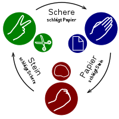

# Assignment: Stein, Papier, Schere, Echse, Spock

*Fällig: 08.05.2022* / [Musterlösung](solution/)

Ihr Zahlenratespiel aus dem letzten Assignment war ein risieger Erfolg: Ähnlich wie [Wordle](https://www.nytimes.com/games/wordle/index.html) oder Jahre zuvor Angry Birds ist das Spiel der absolute Renner und die ganze Welt spielt jetzt Tag und Nacht Zahlenraten. Es gibt plötzlich sowohl Spielkonsolen als auch Grafikkarten, weil niemand mehr die Blockbuster spielen will.

Um an Ihren gigantischen Erfolg anzuknüpfen, wollen Sie ein neues Spiel entwerfen. Natürlich schreiben Sie es wieder in Clojure, denn keine Programmiersprache, außer vielleicht Brainfuck, hat Ihnen bisher so viel Freude bereitet.



**Ziel**: Ziel dieses Assignments ist es, ein komplexeres Spiel in Clojure zu implementieren.

## Schnick-Schnack-Schnuck entwickeln

### Beschreibung des Programms

Schreiben Sie ein einfaches Spiel (`schnick.clj`), bei dem Sie gegen den Computer Schnick-Schnack-Schnuck spielen (auch Rock, Paper, Scissors genannt) mit folgenden Eigenschaften:

  * Das Spiel geht über drei Runden.
  * Es fragt den Spieler nach seiner Auswahl (r, p, s).
  * Der Computer zieht zufällig eine der drei Möglichkeiten.
  * Nach jeder Runde sagt das Spiel, wer welche Möglichkeit gewählt hat und wer die Runde gewonnen hat.
  * Ein Sieg bringt einen Punkt, ein Unentschieden 0 Punkte.
  * Die Punkte jeder Runde werden addiert.
  * Am Ende wird der Gesamtpunktestand ausgegeben.

Eine beispielhafte Session mit dem Programm sieht dann wie folgt aus:

```console
Dein Zug ([r]rock, [p]aper, [s]cissors)?
r
Runde 1 : Du :ROCK - Computer :SCISSORS -> Du hast gewonnen
Dein Zug ([r]rock, [p]aper, [s]cissors)?
r
Runde 2 : Du :ROCK - Computer :ROCK -> Unentschieden
Dein Zug ([r]rock, [p]aper, [s]cissors)?
r
Runde 3 : Du :ROCK - Computer :PAPER -> Der Computer hat gewonnen

Unentschieden - Du 1 Punkt(e), Computer 1 Punkt(e)
```


### Clojure-Features

Bitte verwenden Sie die folgenden Clojure-Features in Ihrem Programm:

  * "Lokale Variablen" mit `let` und somit _keine_ wiederholte Zuweisung an ein Symbol mit `def`
  * Keywords für die interne Abbildung der Züge (`:PAPER`, `:SCISSORS`, `:ROCK`)
  * Ziehen eines zufälligen Elements aus einer Liste mit `shuffle` und `first`
  * Lesen von Zahlen und Strings von der Konsole mit `read-line`
  * Kommentieren Sie Ihre Funktionen!


### Abgabe


Laden Sie den Quelltext Ihres fertigen Programms in Ihr Git-Repository zur Vorlesung hoch. Wählen Sie eine geeignete Verzeichnisstruktur, um auch weitere Lösungen dort ablegen zu können.