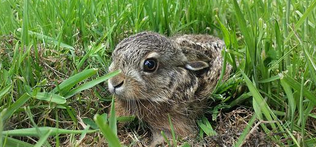

# Aufgabenblock 3: Rekursion


## 1. Tail-Recursion
Schreiben Sie eine Funktion `prod-recur`, die eine beliebige Zahl von Werten multipliziert, die ihr als Vektor oder Sequenz übergeben werden. Verwenden Sie für die Implementierung `loop` und `recur` und __nicht__ `reduce` oder eine andere Funktion außer `*`.

```clojure
(defn prod-recur
  "Berechnet das Produkt einer Reihe von Zahlen `zahlen` unter
  Verwendung von loop und recur."
  [zahlen]
  ; ----> hier Ihr Code <----
)
```


## 2. Was hoppelt den da?

Nach Ihrer umfassenden Tätigkeit im Scalper-Sektor sind Sie komplett erschöpft und brauchen etwas Urlaub. Also buchen Sie von dem Geld, das Sie in den letzten Monaten verdient haben, einen schönen Urlaub in den Alpen. Von Ihrem Zimmer haben Sie einen wunderbaren Blick auf die Wiesen und natürlich die Berge. Das einzige Problem: Es gibt kein Internet und damit entfallen die ganzen schönen Online-Spiele und das Netflixen komplett. Sie tun also das, was man in solch einer Situation macht und schauen aus dem Fenster.



Sie sehen ein Kaninchen, das freudig über die Wiese hoppelt. "Ach, wie schön die Natur ist" denken Sie und seufzen entspannt.

Während Sie so den Kaninchen zuschauen, denken Sie an Fibonacci und den Biologieunterricht in der Schule. Dort haben Sie gelernt, dass die Größe einer Kaninchenpopulation - solange man keine davon erlegt und isst - der Folge der Fibonacci-Zahlen folgt. Da sowieso nichts zu tun ist, setzen Sie sich in und programmieren in Clojure ein entsprechendes, kleines Skript.

Die Fibonacci-Zahlen sind rekursiv definiert als:

  1. F_0 = 0
  2. F_1 = 1
  3. F_n = F_{n-1} + F_{n-2}

Damit ist der Anfang der Fibonacci-Folge:

|   n | 0 | 1 | 2 | 3 | 4 | 5 | 6 |  7 |  8 |  9 |
|-----|---|---|---|---|---|---|---|----|----|----|
| F_n | 0 | 1 | 1 | 2 | 3 | 5 | 8 | 13 | 21 | 34 |


Schreiben Sie ein Clojure-Programm (`kaninchen.clj`), das Fibonacci-Zahlen berechnet und ausgibt.

  * Es soll eine Funktion `fibs` geben, die für den Parameter `n` die dazugehörige Fibonacci-Zahlen bis `n` liefert, also z.B. `(fibs 5)` liefert `(0 1 1 2 3 5)`.
  * Es soll eine Funktion `fib` geben, die für den Parameter `n` die Fibonacci-Zahl an der Stelle `n` liefert, also z.B. `(fib 5)` liefert `5`.
  * Schreiben Sie eine Funktion `karnickel` welche die Anzahl der Kaninchen nach 14 Generationen ausgibt und die Entwicklung der Population als Reihe von Zahlen.

```console
Nach 14 Generationen haben wir 377 Kaninchen
Die Population entwickelt sich so: (0 1 1 2 3 5 8 13 21 34 55 89 144 233 377)
```

  * Verwenden Sie bitte auf jeden Fall eine _Tail-Recursion_ mit `loop` und `recur`.
  * Speichern Sie die Anzahl der Generationen in einem Symbol.
  * Sichern Sie die Funktionen `fib` und `fibs` durch eine Vorbedingung dagegen ab, mit negativen Werten aufgerufen zu werden.
  * Stellen Sie durch eine Nachbedingung bei `fib` sicher, dass das Ergebnis nicht negativ ist.


